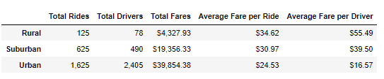

# PyBer-Analysis

## Purpose
An exploratory analysis on PyBer data was conducted to present the the relationship between city type, number of drivers, and number of riders. Charts and graphs were used to depict the relationship between the aforementioned variables as well as the averages and percentages for fares, drivers, and riders per city. This analysis will be used to provide better ride-sharing services, such as accessibility and affordability.

## Results

Based on the data from the box plots and table summary below, there is an obvious disparity between the number of rides, number of drivers, and fare prices per city. Comparing the median for number of rides and the number of drivers between the three city types, the urban areas have the highest number of rides and drivers while the rural areas have the smallest numbers. However, when comparing those same numbers with fare prices for corresponding city types, rural areas had the highest fare prices while urban areas had the lowest. 

## Summary
Due to the low numbers of drivers and riders in rural areas, the price of fares seems to increase by approximately 1.5x the fare prices of urban areas. The accessibility and affordability of ride-share services seem to be offered to more urban areas due to the dense populations, however, the same cannot be the said about other areas with sparser populations.
Recommendations: 
1.	Provide more incentives for drivers to be employed in rural areas
2.	Lower fare prices
3.	 
