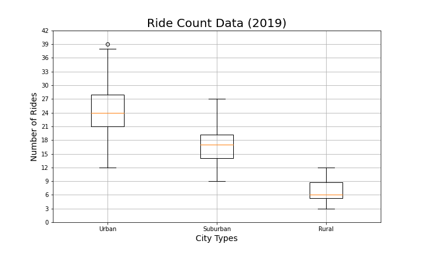

# PyBer-Analysis

## Purpose
An exploratory analysis on PyBer data was conducted to present the the relationship between city type, number of drivers, and number of riders. Charts and graphs were used to depict the relationship between the aforementioned variables as well as the averages and percentages for fares, drivers, and riders per city. This analysis will be used to provide better ride-sharing services, such as accessibility and affordability.

## Results

Based on the data from the box plots in the figures below, there is an obvious disparity between the number of rides, number of drivers, and fare prices per city.

## Summary
